# Forecasting Net Prophet
The purpose of this challenge is to produce a Jupyter notebook using Google Colab that contains your data preparation, analysis, and visualizations for all the time series data for MercadoLibre

---

## Technologies

The cryptocurrency portfolio proposal leverages Python 3.8+ and utilizes the following project libraries and dependencies:
* [JupyterLab](https://jupyterlab.readthedocs.io/en/stable/) - a single integrated development environment (IDE) that allows you to write and run Python programs and review the results in one place
* [Pandas](https://pandas.pydata.org/) - a software library designed for open source data analysis and manipulation
* holoviews
* fbprophet
* datetime
* numpy 
* matplotlib
* hvplot

---

## Installation Guide

Download Anaconda for your operating system and the latest Python version, run the installer, and follow the steps. Restart the terminal after completing the installation. Detailed instructions on how to install Anaconda can be found in the [Anaconda documentation](https://docs.anaconda.com/anaconda/install/).

The Facebook Prophet library can be difficult to install on some machines, so in this challenge you'll utilize Google Colab - an IDE that allows you to run Jupyter Notebooks in the cloud.

---

## Usage
The analysis is hosted on the following GitHub repository at: https://github.com/nguyenthuyt/forecasting_net_prophet   

### **Run instructions:**
To run this analysis, simply clone the repository or download the files and upload the **forecasting_net_prophet.ipynb** to Google Colab

## Step 1: Find unusual patterns in hourly Google search traffic

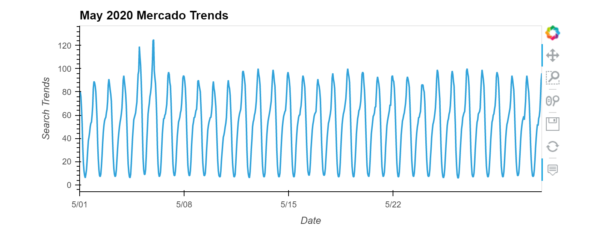

The Google search traffic in May 2020 was 3008.5 higher than the median monthly traffic volume due to MercadoLibre releasing its financial results in that month.

## Step 2: Mine the search traffic data for seasonality
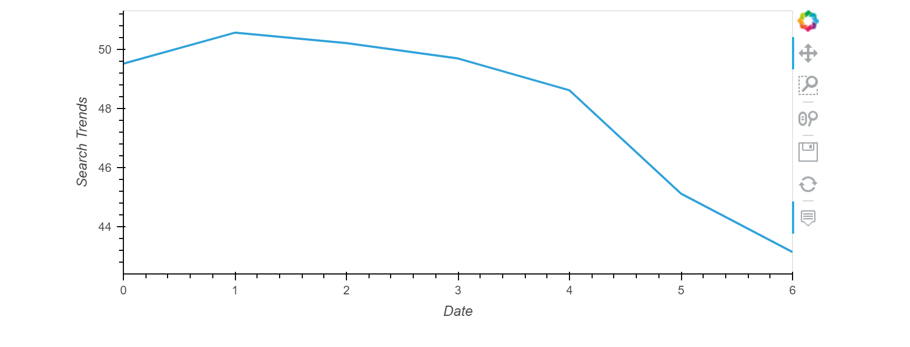

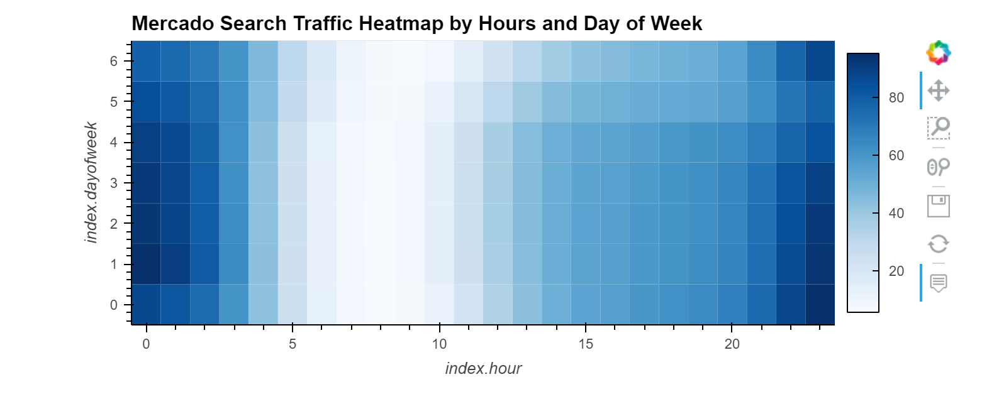

The early hours and last hours of each day have a higher concentration of volume with the highest concentration of search traffic for those hours occurring earlier in the week.

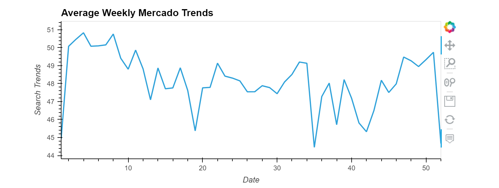

The search traffic is variable throughout the winter holiday period but gradually increases in the week 41 to 51 and then is followed by a sudden drop in search volume.

## Step 3: Relate the search traffic to stock price patterns
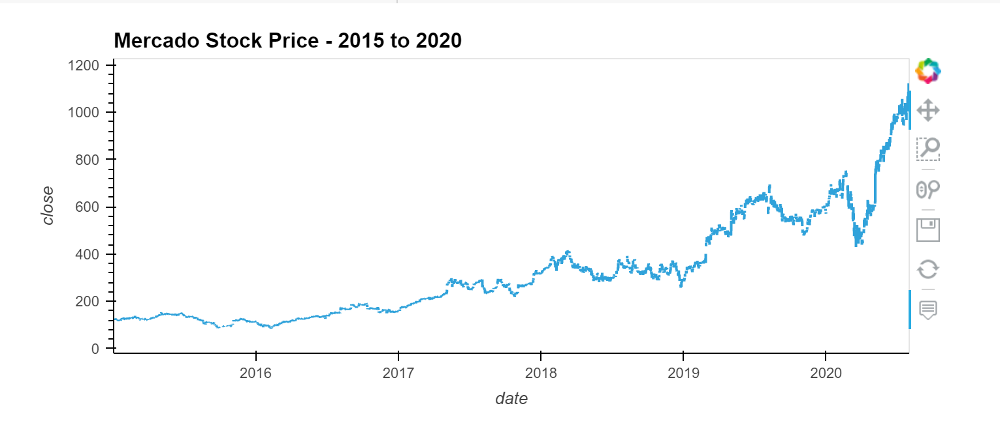
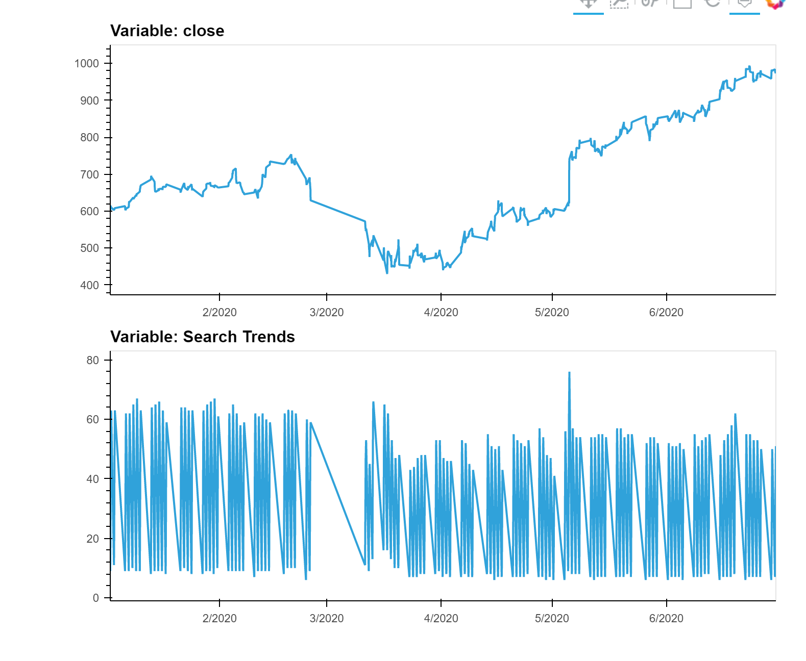

Market events emerged during the year of 2020 that many companies found difficult. But, after the initial shock to global financial markets, new customers and revenue increased for e-commerce platforms. The two preceding graphs are in line with this narrative as there is a huge drop in mid-March 2020 for both stock prices and search trends that subsequently picks back up and increases beginning April 2020 when market confidence is restored.

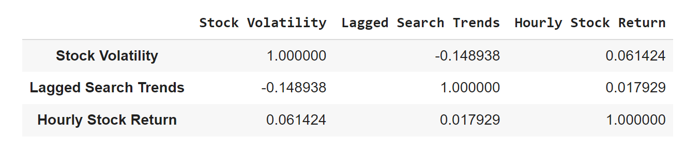
Neither stock volatility nor stock price returns has a strong predictable relationship with lagged search traffic.

## Step 4: Create a time series model with Prophet
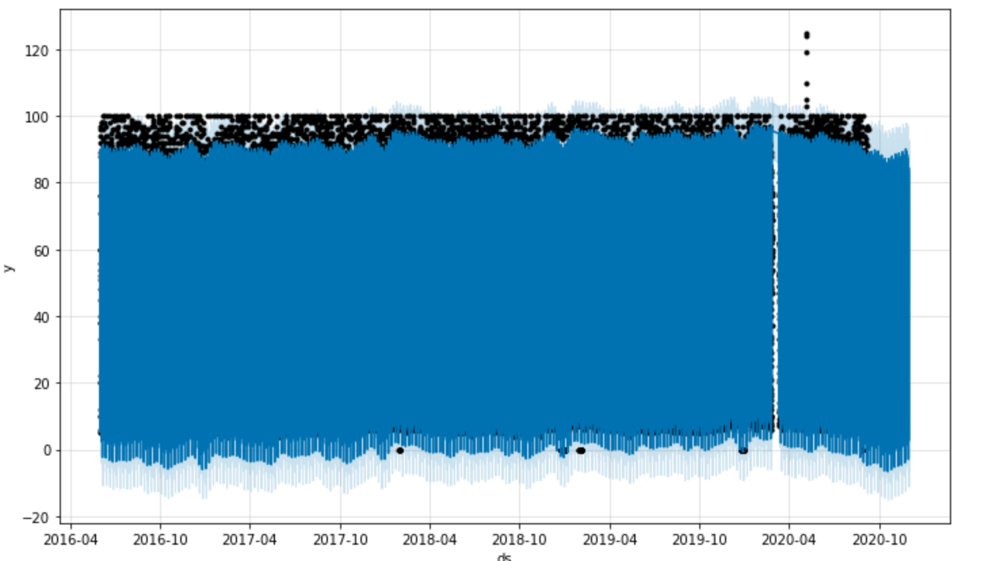
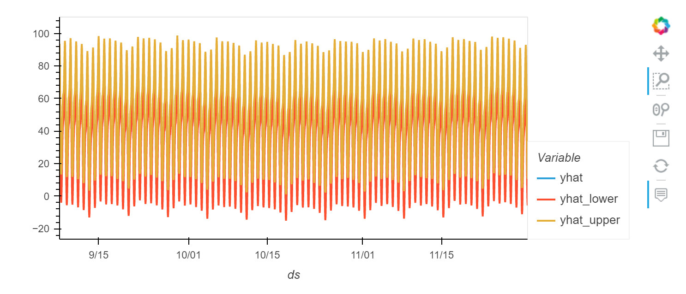
Prophet is forecasting a slight drop in popularity of MercadoLibre.

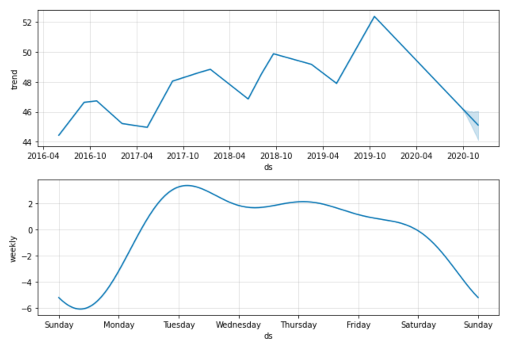
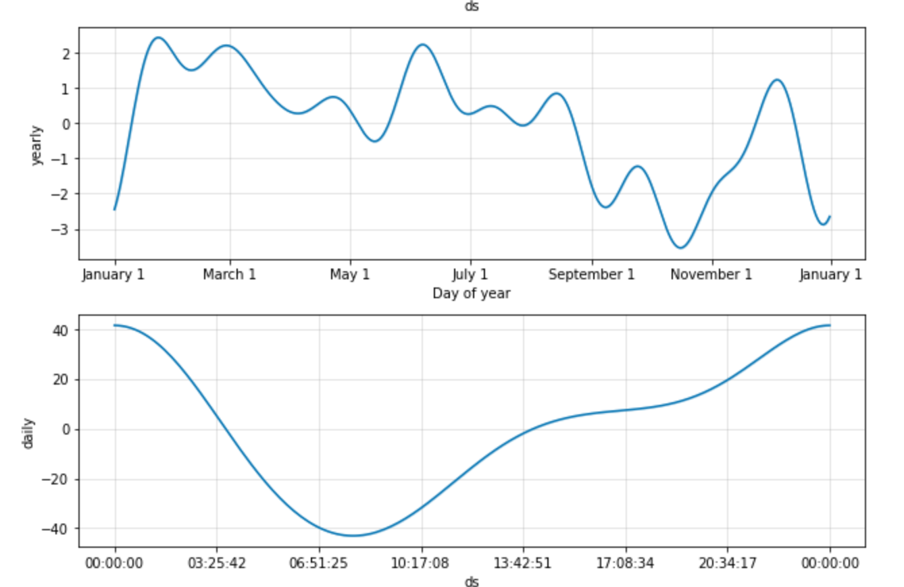
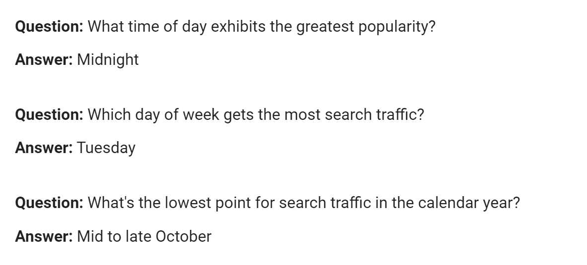

## Step 5 (optional): Forecast revenue by using time series models
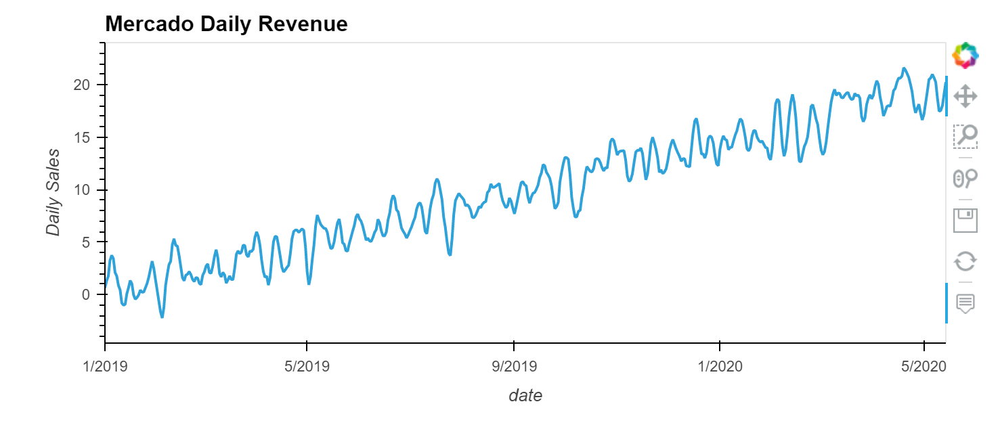
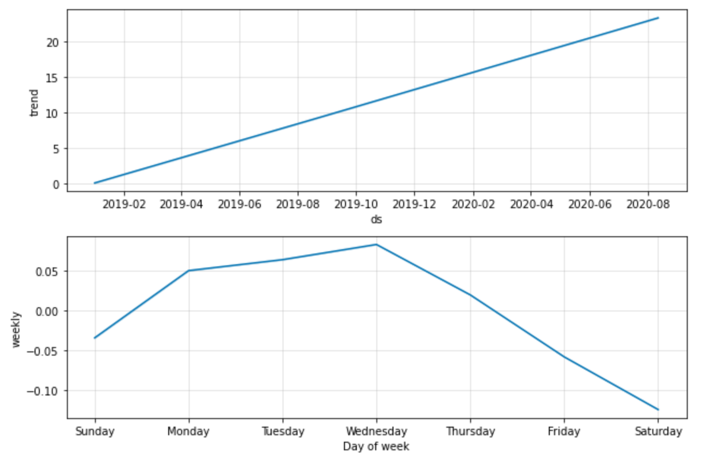
The peak revenue days are Wednesday followed by Tuesday.

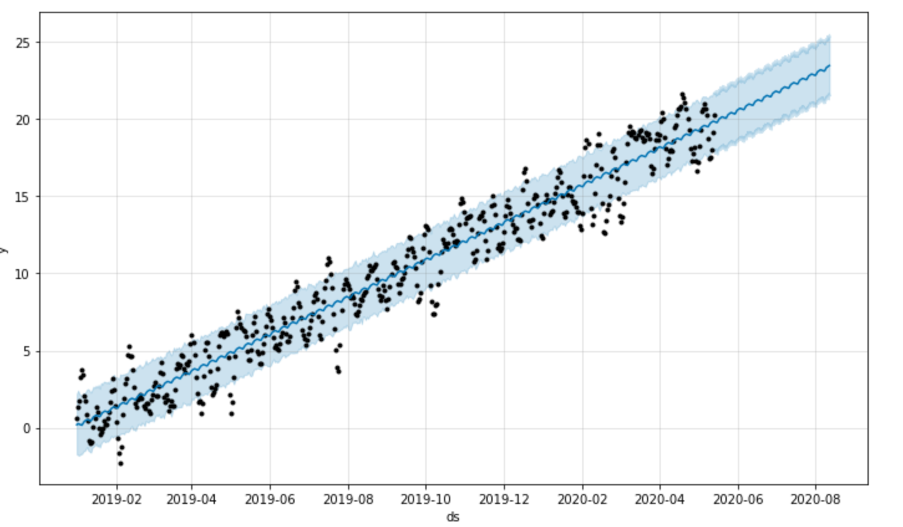
The forecasted total sales for next quarter will most likely be around 22,749M with the worst case of 20,834M and best case of 24,678M.

---

## Contributors

This project was created as part of the Rice Fintech Bootcamp 2022 Program by:

Thuy Nguyen

Email: nguyen_thuyt@yahoo.com

LinkedIn: nguyenthuyt

---

## License

MIT

